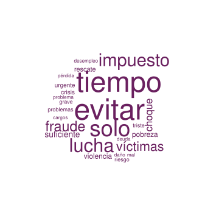
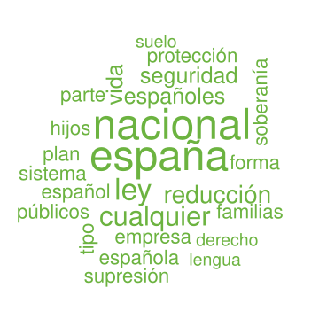
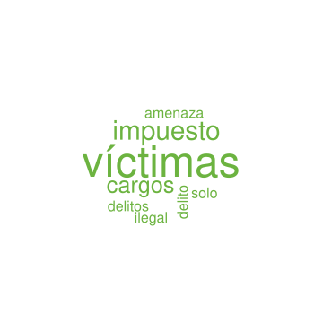
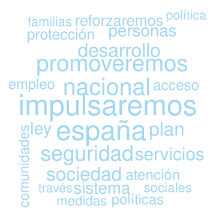
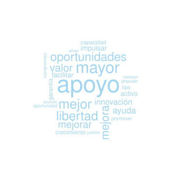
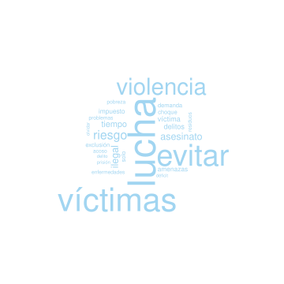
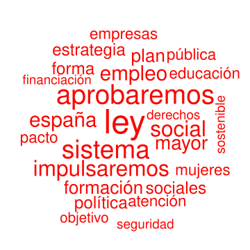
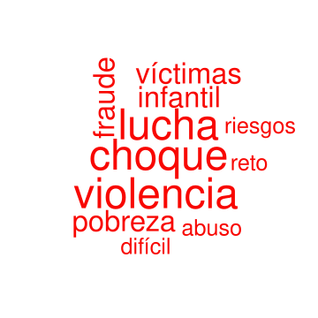

```{r setup, include=FALSE}
knitr::opts_chunk$set(echo = TRUE)
```

## Introducción

El objetivo de este pequeño proyecto es hacer un análisis sencillo (y que sea rápido para tratar de seguir el arroyo turbulento de la actualidad) de los programas electorales de los principales partidos políticos que concurren a las elecciones generales del 28 de abril de 2019.

Para ello he generado unas funciones muy sencillas que a partir de los archivos pdf que publican los distintos partidos crea unoas estrucuturas con formato _tidy text_ según los definido en ["Text Mining with R"](https://www.tidytextmining.com/tidytext.html)

```{r code1, echo=TRUE,eval=FALSE}
pdf2tidytext <- function(pdffile){
  text <- pdf_text(pdffile) 
  text <- text[text!=""]
  #si no tiene retorno se lo ponemos
  text <- sapply(text, function(x) poner_retorno(x))
  text <- sapply(text, function(x) read_lines(x))
  text_df <- lapply(text, function(x) tibble(text=x))
  text_df <- bind_rows(text_df)
  tidytext <- text_df %>% unnest_tokens(word,text)
  #el programa del PSOE se lle mal quedano palabras separadas por letras
  tidytext <- tidytext %>% dplyr::filter(nchar(word)>2)
  return(tidytext)
}

poner_retorno <- function(x){
  if(grepl("\n",x)){
    return(x)
  } else {
    x <- paste(x,"\n",sep="")
  } 
  return(x)
}
```

A partir de estas estructuras con formato _tidy text_ hago dos análisis muy sencillos, el primero es conocer las palabras que aparecen con mayor frecuencia en el documento y el segundo hacer el mismo recuento de palabras más usadas pero separando palabras con una valoración positiva y negativa. Para ello usamos un repositorio de palabras en español según lo explicado en ["Análisis de sentimientos con R - Léxico Afinn"](https://rpubs.com/jboscomendoza/analisis_sentimientos_lexico_afinn).

Esto se sustancia en las siguientes fucniones:

```{r code2, echo=TRUE,eval=FALSE}
frecuencia_palabras <- function(tidytext,color,nombre){
  custom_stop_words <- data_frame(word = tm::stopwords("spanish"),lexicon = "custom")
  svg(sprintf("%s.svg",nombre),width = 5,height = 5)
  wc <- tidytext %>% anti_join(custom_stop_words) %>% dplyr::filter(!str_detect(word, "^[0-9]")) %>% count(word,sort=TRUE) %>% with(wordcloud(word, n, random.order = FALSE, max.words = 25,colors = color,scale = c(4,0.2)))
  dev.off()
  return(wc)
}

analisis_sentimientos <- function(tidytext,color,nombre){
  custom_stop_words <- data_frame(word = tm::stopwords("spanish"),lexicon = "custom")
  sentimientos <- tidytext %>% anti_join(custom_stop_words) %>% dplyr::filter(!str_detect(word, "^[0-9]")) %>% unnest_tokens(input = "word", output = "Palabra") %>% 
    inner_join(afinn, ., by = "Palabra")  %>% 
  mutate(Tipo = ifelse(Puntuacion > 0, "Positiva", "Negativa")) %>% dplyr::rename(word=Palabra)
  l.sentimientos <- split(sentimientos,sentimientos$Tipo)
  frecuencia_palabras(tidytext = l.sentimientos$Positiva,color = color,nombre=sprintf("%s_positivos",nombre))
  frecuencia_palabras(tidytext = l.sentimientos$Negativa,color = color,nombre=sprintf("%s_negativos",nombre))
}

analiza_programas <- function(partido){
  programas <- read.csv("file_archivos.csv",header = TRUE,sep=";")
  programa <- programas[programas$partido==partido,]$direccion
    color <- programas[programas$partido==partido,]$color
    texto <- pdf2tidytext(pdffile = programa)
    
    wc <- frecuencia_palabras(tidytext = texto,color = color,nombre=sprintf("frecuencia_%s",partido))
    wc.sent <- analisis_sentimientos(tidytext = texto,color = color,nombre=sprintf("sentimientos_%s",partido))
}
```

## Resultados

### PODEMOS




### VOX





### PP





### PSOE



